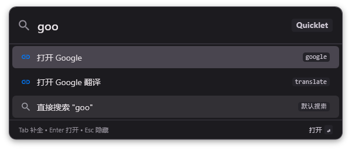

<div align="center">

# ⚡ Quicklet

**极简、极速的 Windows 网页直达与带参搜索效率神器**

*去除繁杂，键盘优先 — 让网页打开与搜索从数步繁琐缩短至 1 秒按键*

[](https://github.com/stefory/Quicklet)
[](https://github.com/stefory/Quicklet)
[](https://github.com/stefory/Quicklet)
[](LICENSE)

</div>

---

<div align="center">

| 深色模式 (Dark Theme) | 浅色模式 (Light Theme) |
| :---: | :---: |
|  |  |

</div>

---

## 📖 为什么选择 Quicklet？ (Why Quicklet?)

在日常开发与办公中，我们每天需要几十次在浏览器中搜索或打开特定的网站（如 GitHub 仓库、Google 翻译、哔哩哔哩、YouTube 或公司内部系统）。

传统的习惯是：**切到浏览器 -> 新建标签页 -> 找到书签或手动输入网址 -> 输入搜索词 -> 回车**。这个过程不仅步骤繁琐，而且极易打断当前的专注工作流。

**Quicklet 的解决之道**：
去除一切繁杂干扰，让搜索回归极简与极速——**按下全局热键 `Alt + Q`，敲入关键字加搜索词，回车即刻直达！**

---

## 🚀 核心特点 (Key Features)

### 1. 📦 极致轻量 (Ultra-Lightweight)
* **超小体积**：独立发布单文件可执行程序体积仅 **~200 KB**，无任何庞大的 Electron 或 WebView2 内存负担。
* **极低资源**：开机后台驻留几乎无感，纯净无广告、无多余后台服务。

### 2. ⚡ 秒级唤起与响应 (Instant & Keyboard-First)
* **随叫随到**：默认全局热键 `Alt + Q`（支持任意自定义组合键），在任何应用中按下瞬间唤起搜索框，按 `Esc` 0毫秒隐去。
* **键盘优先**：全流程无需鼠标，支持 `Tab` 键快速补全触发词，按方向键选项目，回车直接执行。

### 3. 🎯 效率翻倍：双模式智能搜索 (Smart Search Routing)
* **网页直达 (Direct Jump)**：输入关键字（如 `gh` 或 `bilibili`）按 Enter，直接一秒直达目标网站首页。
* **带参搜索 (Parametric Search)**：输入 `gh wpf` 或 `translate 效率工具`，自动将检索词带入目标搜索模板，一步完成精确搜索。
* **默认搜索兜底**：输入非关键字内容时，自动使用配置的默认搜索引擎（支持 Google、Bilibili、GitHub、百度、必应等）。

### 4. ⚙️ 开箱即用 & 灵活配置 (Zero-Cost Configuration)
* **自适应系统主题**：简洁干净的卡片界面，支持跟随 Windows 10/11 的亮色与深色主题自动无缝切换。
* **可视化配置管理**：内置轻量设置中心，直观修改热键、自启动及搜索规则，支持实时热加载（无需重启软件）。

---

## 💡 常用高效使用场景 (Usage Examples)

只需按下全局热键 `Alt + Q` 唤起 Quicklet，即可通过简洁的触发词实现秒级检索与直达：

| 适用场景 | 输入示例 | 动作与效果 |
| :--- | :--- | :--- |
| **网站直达** | `github` 或 `bilibili` | 仅输入关键字按回车，瞬间在浏览器中打开站点首页 |
| **即时翻译** | `translate 效率` | 一秒唤起 Google 翻译查询 `效率` 对应译词 |
| **视频学习** | `bilibili 教程` | 直接在 B 站检索 `教程` 相关视频内容 |
| **电商采购** | `1688 供应商` | 直接打开 1688 检索 `供应商` 货源信息 |
| **代码搜索** | `github wpf` | 直接打开 GitHub 搜索 `wpf` 相关开源项目 |
| **本地工具启动** | `file:///D:/tools/index.html` | 支持一秒唤起本地 HTML 工具包、本地网页或脚本 |

> **⌨️ 快捷操作秘籍**：
> * `Alt + Q` ：全局随时唤起 / 隐藏搜索框
> * `Tab` ：一键快速补全当前匹配到的触发词（例如输入 `gi` 按 `Tab` 自动补全为 `github `）
> * `↑` / `↓` ：在建议匹配列表中自由上下切换项
> * `Enter` ：执行打开选中的网页或搜索结果
> * `Esc` ：0 毫秒快速收起隐藏窗口

---

## 📦 配置文件说明 (`config.json`)

Quicklet 的配置文件存放在程序同级目录下的 `config.json` 中，格式简单直观：

```json
{
  "Hotkey": "Alt+Q",
  "Theme": "Auto",
  "DefaultSearchUrl": "https://www.google.com/search?q={query}",
  "StartupWithWindows": false,
  "Keywords": [
    {
      "Keyword": "google",
      "Name": "Google",
      "Url": "https://www.google.com",
      "SearchUrl": "https://www.google.com/search?q={query}"
    },
    {
      "Keyword": "github",
      "Name": "GitHub",
      "Url": "https://github.com",
      "SearchUrl": "https://github.com/search?q={query}"
    },
    {
      "Keyword": "bilibili",
      "Name": "哔哩哔哩",
      "Url": "https://www.bilibili.com",
      "SearchUrl": "https://search.bilibili.com/all?keyword={query}"
    }
  ]
}
```

---

## 🚀 编译与构建 (Build & Publish)

### 开发环境要求
* Windows 10 / 11
* .NET 8.0 SDK 或更高版本

### 编译与发布单文件 Exe

```bash
# 克隆项目
git clone https://github.com/stefory/Quicklet.git
cd Quicklet

# 编译项目
dotnet build

# 发布为 Release 单文件绿色版
dotnet publish -c Release -r win-x64 --self-contained false /p:PublishSingleFile=true /p:PublishReadyToRun=true
```

发布成功后，你可以在 `publish/` 目录下找到轻量的 `Quicklet.exe`。

---

## 📄 开源许可证 (License)

本项目基于 [MIT License](LICENSE) 开源，欢迎自由下载、使用或提交 PR！
